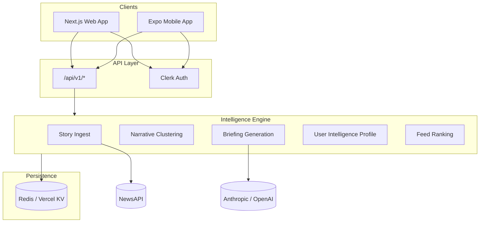

# Your News

**Personalized AI intelligence briefings for professionals who need signal, not noise.**

Your News ingests live news, clusters narratives, generates editorial-quality briefings and per-story intelligence, and ranks a personalized feed using a User Intelligence Profile (UIP). Available on web (Next.js) and mobile (Expo).

---

## Problem

News is abundant; **relevant context** is not. Professionals waste time scanning feeds, miss emerging narratives, and lack actionable framing. Generic AI summaries repeat article text and ignore individual interests.

## Solution

Your News delivers:

- **Global Intelligence** — curated daily briefing across top stories
- **For You Intelligence** — personalized briefing sections from your UIP and topic preferences
- **Signals** — momentum-ranked narrative clusters with explainable relevance
- **Story Intelligence** — per-article briefing, watch items, and actions
- **Saved Stories** — cross-device sync via API v1

---

## Screenshots

| Web Dashboard | Mobile Briefings | Signals |
|---------------|------------------|---------|
| _Add screenshot: `docs/assets/web-dashboard.png`_ | _Add screenshot: `docs/assets/mobile-briefings.png`_ | _Add screenshot: `docs/assets/mobile-signals.png`_ |

> Place marketing screenshots in `docs/assets/` before App Store / investor materials.

---

## Architecture



See [docs/ARCHITECTURE.md](./docs/ARCHITECTURE.md) for component-level detail.

---

## Technology stack

| Layer | Technology |
|-------|------------|
| Web | Next.js 16, React 19, Tailwind CSS v4, shadcn/ui, Framer Motion |
| Mobile | Expo 54, Expo Router, React Native |
| Auth | Clerk (session cookies + Bearer JWT for mobile) |
| Persistence | Upstash Redis / Vercel KV |
| Ingest | NewsAPI |
| Intelligence | Anthropic Claude (primary), OpenAI (fallback) |
| Deploy | Vercel (web/API), EAS (mobile) |

---

## Quick start — Web

```bash
cp .env.example .env.local
# Fill Clerk, Redis, NEWS_API_KEY, ANTHROPIC_API_KEY

npm install
npm run dev
```

Open [http://localhost:3000](http://localhost:3000). New users: sign up → onboarding → dashboard.

---

## Quick start — Mobile

```bash
cd mobile
cp .env.example .env
# EXPO_PUBLIC_API_BASE_URL=http://192.168.x.x:3000/api/v1
# EXPO_PUBLIC_CLERK_PUBLISHABLE_KEY=...

npm install
npx expo start
```

See [docs/MOBILE_ARCHITECTURE.md](./docs/MOBILE_ARCHITECTURE.md) and [mobile/README.md](./mobile/README.md).

---

## Environment variables

Copy [`.env.example`](./.env.example). Required for full functionality:

| Group | Variables |
|-------|-----------|
| Auth | `NEXT_PUBLIC_CLERK_PUBLISHABLE_KEY`, `CLERK_SECRET_KEY` |
| Redis | `UPSTASH_REDIS_REST_URL`, `UPSTASH_REDIS_REST_TOKEN` |
| Ingest | `NEWS_API_KEY` |
| AI | `ANTHROPIC_API_KEY`, `AI_PROVIDER` |

Mobile mirrors Clerk and API URL via `EXPO_PUBLIC_*` in `mobile/.env` (`EXPO_PUBLIC_API_BASE_URL`).

---

## Development workflow

```bash
npm run dev          # Web dev server
npm run lint         # ESLint
npx tsc --noEmit     # Typecheck
npm test             # Vitest unit tests
npm run verify:isolation  # Multi-user KV isolation script
```

Mobile: `cd mobile && npx expo start`

---

## Deployment workflow

| Target | Guide |
|--------|-------|
| Web + API | [docs/DEPLOYMENT.md](./docs/DEPLOYMENT.md) — Vercel, Redis, Clerk |
| iOS / Android | EAS Build + App Store Connect |
| Rollback | Redeploy previous Vercel deployment; KV snapshots are versioned by key prefix |

Production checklist: [docs/DEPLOYMENT.md#production-checklist](./docs/DEPLOYMENT.md)

---

## Testing workflow

```bash
npm test                  # Unit tests (Vitest)
npm run test:coverage     # Coverage report
npm run test:integration  # API smoke (requires running server + API_TEST_BASE_URL)
```

See [docs/TESTING.md](./docs/TESTING.md).

---

## Project structure

```
your-news/
├── app/                    # Next.js App Router (pages, API v1)
├── components/             # Web UI components
├── lib/
│   ├── intelligence/       # Platform snapshot, story intelligence
│   ├── briefing/           # Global + For You briefing engines
│   ├── signals/            # Momentum, clustering, explain
│   ├── personalization/    # UIP, relevance, topic preferences
│   ├── persistence/        # Redis/KV keys and store
│   ├── services/           # User-scoped service layer
│   └── api/                # Auth, serializers, response helpers
├── mobile/                 # Expo React Native app
├── tests/                  # Vitest unit + integration tests
├── scripts/                # Isolation verification, tooling
└── docs/                   # Architecture, API, runbooks, readiness
```

---

## Documentation index

| Document | Description |
|----------|-------------|
| [docs/ARCHITECTURE.md](./docs/ARCHITECTURE.md) | System design |
| [docs/API.md](./docs/API.md) | REST API v1 reference |
| [docs/INTELLIGENCE_ENGINE.md](./docs/INTELLIGENCE_ENGINE.md) | Briefings, signals, UIP |
| [docs/MULTI_TENANCY.md](./docs/MULTI_TENANCY.md) | User isolation |
| [docs/MOBILE_ARCHITECTURE.md](./docs/MOBILE_ARCHITECTURE.md) | Expo app structure |
| [docs/DEPLOYMENT.md](./docs/DEPLOYMENT.md) | Vercel, Redis, EAS |
| [docs/SECURITY.md](./docs/SECURITY.md) | Security review |
| [docs/TESTING.md](./docs/TESTING.md) | Test strategy |
| [docs/PRODUCT.md](./docs/PRODUCT.md) | Product overview |
| [docs/APP_STORE_CHECKLIST.md](./docs/APP_STORE_CHECKLIST.md) | Launch checklist |
| [docs/PROJECT_READINESS_REPORT.md](./docs/PROJECT_READINESS_REPORT.md) | Readiness grades |

---

## Roadmap

- [ ] App Store / Play Store launch (EAS production builds)
- [ ] Push notifications for briefing refresh
- [ ] Rate limiting and API observability (Sentry, PostHog)
- [ ] Expanded e2e test coverage (Playwright + Detox)
- [ ] Privacy policy, terms, and support URL (App Store requirements)
- [ ] Weekly briefing cadence UI polish

---

## License

[MIT](./LICENSE) — update copyright holder before public release if needed.

---

## Contributing

See [CONTRIBUTING.md](./CONTRIBUTING.md) and [CODE_OF_CONDUCT.md](./CODE_OF_CONDUCT.md).
