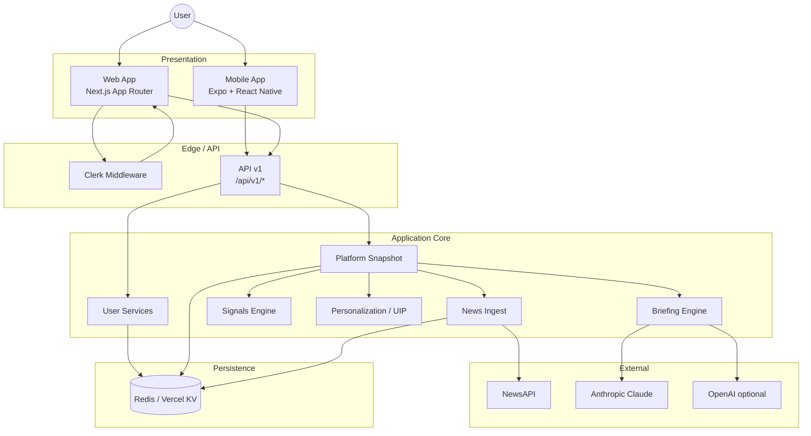
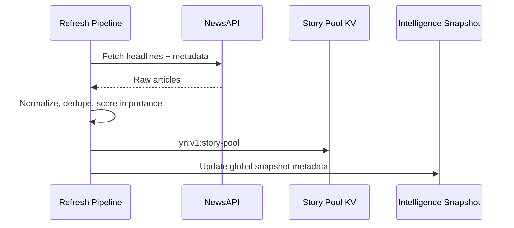
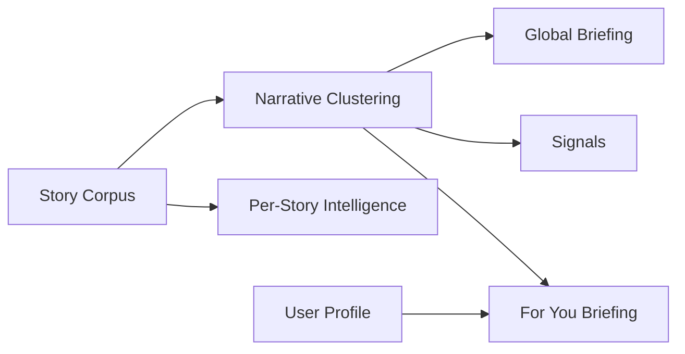
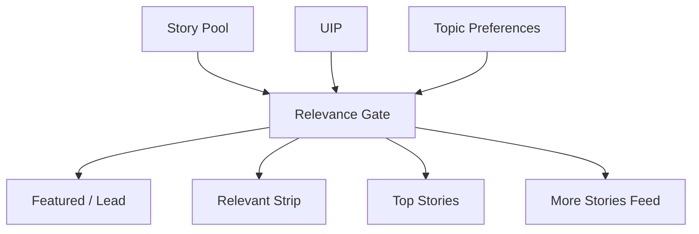
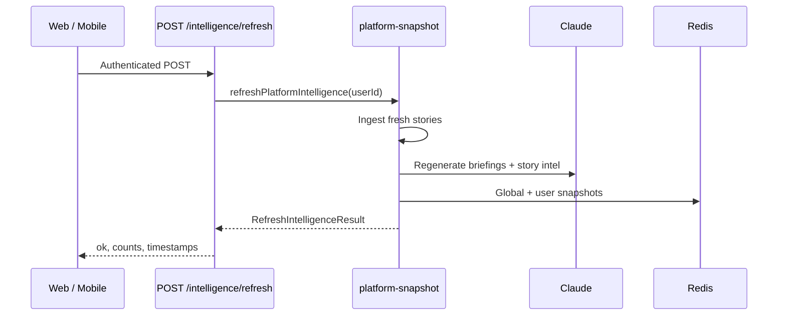

# Architecture

Your News is a full-stack personalized intelligence platform: web and mobile clients authenticate via Clerk, call a shared Next.js API layer, and receive dashboard payloads assembled from a Redis-backed intelligence engine.

---

## System overview

---

## Components

### Dashboard (`lib/intelligence/platform-snapshot.ts`)

Central orchestrator. Loads or refreshes:

- Story pool (global ingest cache)
- Global intelligence snapshot (briefings + metadata)
- Per-user intelligence snapshot (For You briefing, UIP overlay)
- Applies read-time repairs (For You section quality, coverage dates)

Exposed via `GET /api/v1/dashboard` and used by web SSR paths.

### Briefings (`lib/briefing/`)

| Cadence | Description |
|---------|-------------|
| **Global** | Daily editorial briefing across top corpus stories |
| **For You** | Personalized sections from UIP + topic preferences + saved behavior |

Engines: `weekly-engine.ts`, `for-you-sections.ts`, corpus narratives, quality validation.

### Signals (`lib/signals/`)

Narrative clusters with **momentum scoring** and human-readable explanations. Consumed on dashboard and `GET /api/v1/signals`.

### Story Intelligence (`lib/intelligence/`)

Per-story AI package: briefing memo, why it matters, watch, action. Quality gates in `story-intelligence-quality.ts` prevent raw article leakage.

### UIP — User Intelligence Profile (`lib/personalization/`)

Derived from onboarding, topic preferences, saved stories, and implicit behavior. Drives For You sections and relevance scoring.

### Saved Stories (`lib/services/saved-stories.ts`)

User-scoped list stored under profile keys in KV. Synced via `GET/POST /api/v1/profile/saved`.

### Topic Preferences (`lib/services/topic-preferences.ts`)

Explicit topic boosts/suppressions. `GET/PUT /api/v1/profile/topics`.

---

## Data flow

### Story ingestion

1. Triggered by `POST /api/v1/intelligence/refresh` or web settings action.
2. `lib/news.ts` fetches from NewsAPI with TTL cache.
3. Normalized `Story` objects persisted to `yn:v1:story-pool`.

### Intelligence generation

- **Global briefing** — AI synthesis over ranked corpus (`lib/briefing/weekly-engine.ts`).
- **For You** — Sections built from clusters weighted by UIP (`lib/briefing/for-you-sections.ts`).
- **Story intelligence** — Generated per slug + profile hash, cached in KV.

### Feed ranking

Implemented in `lib/personalization/relevance-gate.ts`, `lib/feed/more-stories.ts`, serialized in `serialize-dashboard.ts`.

### Personalization

| Input | Effect |
|-------|--------|
| Onboarding interests / career | Base UIP facets |
| Topic preferences | Boost/suppress categories and tags |
| Saved stories | Implicit interest signals |
| Refresh Intelligence | Recomputes UIP + For You briefing |

### Refresh Intelligence

Max duration: 300s (Vercel Pro required for long-running refresh).

---

## Web vs mobile

| Concern | Web | Mobile |
|---------|-----|--------|
| Auth | Clerk session cookies | Clerk + Bearer JWT |
| Data | SSR + server actions + API | API v1 hooks |
| Navigation | App Router pages | Expo Router tabs + stacks |
| Briefings | React server components | `BriefingView` + pager |

---

## Key directories

| Path | Role |
|------|------|
| `app/api/v1/` | Mobile-facing REST API |
| `app/story/[slug]/` | Web story detail (SSR) |
| `lib/intelligence/platform-snapshot.ts` | Dashboard + refresh |
| `lib/persistence/keys.ts` | KV key schema |
| `lib/api/auth.ts` | Session + Bearer auth |
| `mobile/src/api/` | HTTP client |
| `mobile/src/hooks/` | Data fetching hooks |

---

## Related documents

- [API.md](./API.md) — Endpoint reference
- [INTELLIGENCE_ENGINE.md](./INTELLIGENCE_ENGINE.md) — Deep dive
- [MULTI_TENANCY.md](./MULTI_TENANCY.md) — User isolation
- [MOBILE_ARCHITECTURE.md](./MOBILE_ARCHITECTURE.md) — Expo structure
- [DEPLOYMENT.md](./DEPLOYMENT.md) — Production setup
