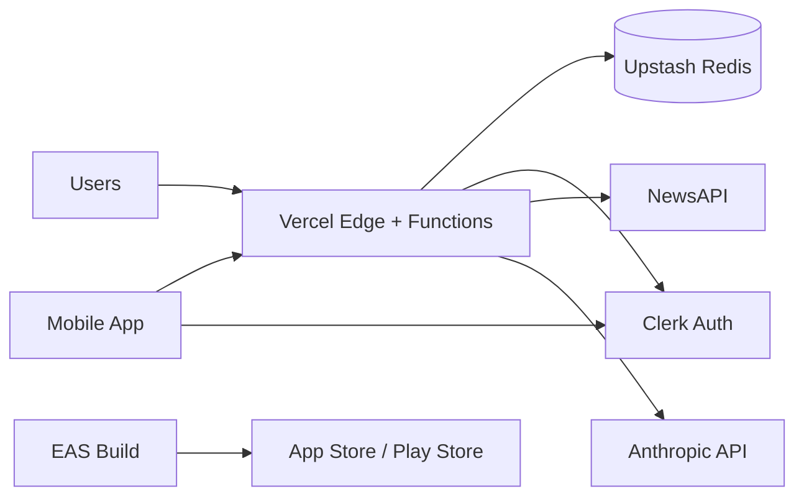

# Deployment Guide

Production deployment for Your News spans Vercel (web + API), Upstash Redis, Clerk, and Expo EAS (mobile).

---

## Architecture in production



---

## Vercel deployment

### 1. Connect repository

1. Import GitHub repo in [Vercel Dashboard](https://vercel.com)
2. Framework preset: **Next.js**
3. Root directory: `.` (monorepo root)

### 2. Environment variables

Set all variables from [`.env.example`](../.env.example):

| Required | Variable |
|----------|----------|
| ✅ | `NEXT_PUBLIC_CLERK_PUBLISHABLE_KEY` |
| ✅ | `CLERK_SECRET_KEY` |
| ✅ | `UPSTASH_REDIS_REST_URL` |
| ✅ | `UPSTASH_REDIS_REST_TOKEN` |
| ✅ | `NEWS_API_KEY` |
| ✅ | `ANTHROPIC_API_KEY` |

**Disable in production:**

- `NEWS_FILE_PERSISTENCE` — omit or set `false` (file fallback is for local dev only)

### 3. Function timeout

`/api/v1/intelligence/refresh` sets `maxDuration = 300`. Requires **Vercel Pro** (or equivalent) for 300s serverless duration.

### 4. Deploy

```bash
vercel --prod
```

Or push to `main` with Vercel Git integration.

---

## Redis setup (Upstash)

1. Create database at [console.upstash.com](https://console.upstash.com)
2. Copy REST URL and token to Vercel env
3. Alternative: Vercel KV marketplace integration (`KV_REST_API_*` aliases)

### Key prefixes

All keys use `yn:v*` prefixes — safe to share a Redis instance with other apps if prefixes differ.

### Staging recommendation

Use a separate Upstash database for staging/preview deployments.

---

## Clerk setup

1. Create application at [dashboard.clerk.com](https://dashboard.clerk.com)
2. Enable Email + Google (mobile uses Google OAuth)
3. Copy publishable + secret keys to Vercel
4. **Allowed origins** — add production domain and Expo dev origins
5. **JWT templates** — mobile uses session JWT as Bearer token; default Clerk session JWT works with `verifyToken`

### Mobile redirect URLs

Configure OAuth redirect URLs for Expo scheme (`yournews://` or app-specific scheme in `mobile/app.json`).

---

## Mobile build setup

### Prerequisites

- Apple Developer account (iOS)
- Google Play Console (Android)
- Expo account

### Environment (`mobile/.env`)

```env
EXPO_PUBLIC_API_BASE_URL=https://your-production-domain.vercel.app/api/v1
EXPO_PUBLIC_CLERK_PUBLISHABLE_KEY=pk_live_...
```

Use LAN IP for local device testing: `http://192.168.x.x:3000`

### Local development

```bash
cd mobile
npm install
npx expo start
```

---

## EAS setup

Config: `mobile/eas.json`

### Build profiles

| Profile | Use |
|---------|-----|
| `development` | Dev client, internal |
| `preview` | Internal TestFlight / APK |
| `production` | Store release (`autoIncrement: true`) |

### Commands

```bash
cd mobile
npm install -g eas-cli
eas login
eas build:configure
eas build --platform ios --profile production
eas build --platform android --profile production
```

### Submit (iOS)

Fill submit config in `eas.json`:

```json
"submit": {
  "production": {
    "ios": {
      "appleId": "you@company.com",
      "ascAppId": "1234567890",
      "appleTeamId": "ABCDE12345"
    }
  }
}
```

```bash
eas submit --platform ios --profile production
```

---

## App Store release

See [APP_STORE_CHECKLIST.md](./APP_STORE_CHECKLIST.md) for full checklist.

Summary:

1. Production EAS build
2. TestFlight internal → external testing
3. App Store Connect metadata + screenshots
4. Privacy policy URL (required)
5. Submit for review

---

## Environment variables reference

| Group | Variables | Where |
|-------|-----------|-------|
| Auth | Clerk keys | Vercel + mobile `.env` |
| Redis | Upstash REST | Vercel only |
| AI | Anthropic, OpenAI | Vercel only |
| Ingest | NewsAPI | Vercel only |
| Mobile | `EXPO_PUBLIC_*` | EAS secrets + local `.env` |

Full list: [`.env.example`](../.env.example)

---

## Production checklist

- [ ] All required env vars set in Vercel production
- [ ] Redis connected (`GET /api/v1/health` → `redisConfigured: true`)
- [ ] Clerk production instance with correct domains
- [ ] `NEWS_FILE_PERSISTENCE` disabled
- [ ] Intelligence refresh completes within timeout
- [ ] Mobile `EXPO_PUBLIC_API_BASE_URL` points to production
- [ ] EAS production credentials configured
- [ ] Privacy policy and terms hosted
- [ ] Error monitoring (Sentry) — recommended
- [ ] CI passing on `main`

---

## Rollback process

### Web / API (Vercel)

1. Open Vercel project → Deployments
2. Find last known-good deployment
3. **Promote to Production** (instant rollback)

KV data is **not** rolled back with deployments. If a bad refresh corrupted snapshots:

1. Redeploy previous code
2. Trigger **Refresh Intelligence** from a staging admin account, or
3. Restore Redis from Upstash backup (if enabled)

### Mobile

- Cannot roll back installed apps — submit fixed build
- Use phased release in App Store Connect to limit blast radius

---

## Monitoring

Recommended (not yet wired by default):

- **Vercel** — function logs, analytics
- **Upstash** — Redis metrics
- **Sentry** — `SENTRY_DSN` / `EXPO_PUBLIC_SENTRY_DSN`
- **Uptime** — ping `/api/v1/health` every 60s

---

## Related runbooks

- [RUNBOOKS/vercel-failure.md](./RUNBOOKS/vercel-failure.md)
- [RUNBOOKS/redis-down.md](./RUNBOOKS/redis-down.md)
- [RUNBOOKS/refresh-failure.md](./RUNBOOKS/refresh-failure.md)
- [RUNBOOKS/app-store-build-failure.md](./RUNBOOKS/app-store-build-failure.md)
