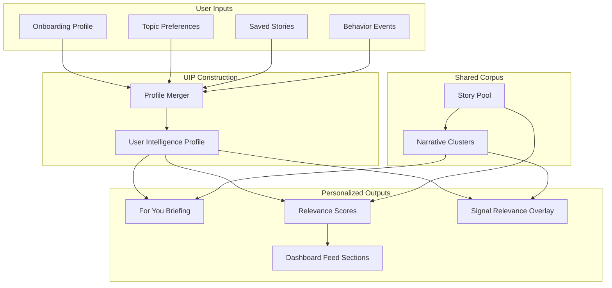
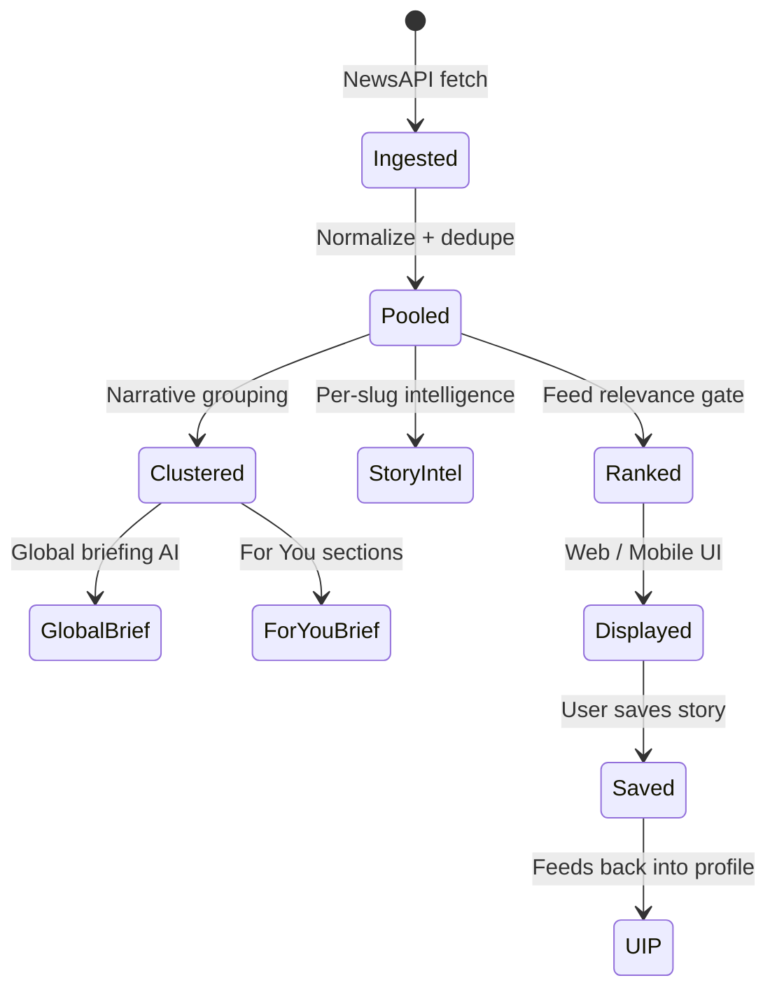

# Personalization Pipeline

How user-specific signals flow from profile data to ranked content.

## Story lifecycle

See [INTELLIGENCE_ENGINE.md](./INTELLIGENCE_ENGINE.md) and [ARCHITECTURE.md](./ARCHITECTURE.md) for implementation detail.
