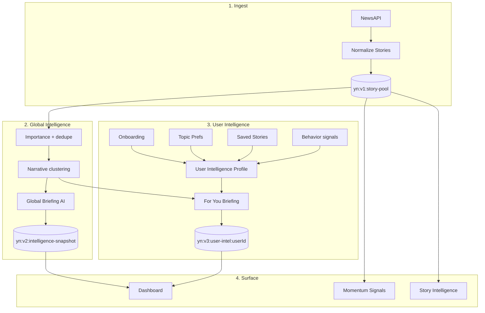
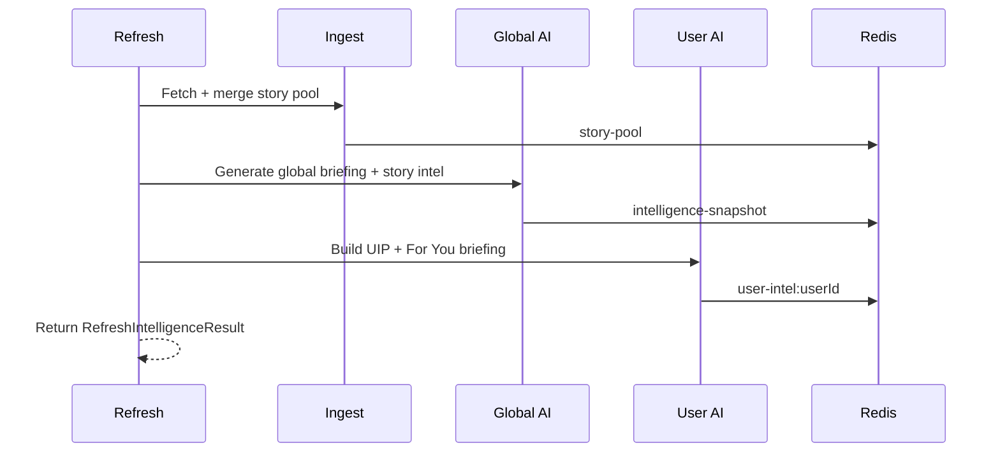

# Intelligence Engine

This document explains how Your News transforms raw news into personalized intelligence. A new engineer should be able to trace any briefing, signal, or feed item from ingest to UI using this guide.

---

## Pipeline overview

---

## Story ingestion

**Entry:** `lib/news.ts`, triggered during `refreshPlatformIntelligence`.

1. Fetch from NewsAPI using `NEWS_API_KEY`.
2. Normalize to internal `Story` type (slug, headline, summary, category, tags, importance, publishedAt).
3. Deduplicate by slug / URL fingerprint.
4. Persist to **`yn:v1:story-pool`** with TTL governed by `NEWS_CACHE_TTL_MS`.
5. On API failure, serve stale pool up to policy window (see `NEWS_STALE_MAX_MS` in `.env.example`).

Article body text (when fetched) uses **`yn:v1:article-bodies`** for intelligence generation context.

---

## Narrative clustering

Signals and For You sections group stories into **narrative clusters** — shared themes detected via tags, entities, headlines, and category overlap.

Key modules:

- `lib/signals/momentum.ts` — cluster momentum over time
- `lib/signals/explain.ts` — human-readable signal explanations
- `lib/briefing/shared/for-you-corpus-narratives.ts` — corpus-driven section copy

Clusters must not expose debug metadata in user-facing titles (e.g. `[Cluster] (N stories)` is rejected by quality gates).

---

## Signal generation

**Output:** ranked list of signals with momentum score ∈ [0, 1].

| Factor | Role |
|--------|------|
| Story count in cluster | Volume signal |
| Recency | Time decay |
| Importance scores | Editorial weight |
| User relevance | UIP-weighted boost for `/signals` API |

Momentum formula lives in `lib/signals/momentum.ts`. Explanations in `lib/signals/explain.ts` tie clusters to user interests when profile is complete.

---

## Briefing generation

### Global briefing

- **Cadence:** Daily (primary product surface).
- **Engine:** `lib/briefing/weekly-engine.ts` (name retained; operates on daily corpus).
- **Input:** Top-N stories by importance + diversity.
- **Output:** `IntelligenceBriefing` with sections (headline, narrative body, watch, action).
- **AI:** Anthropic Claude via `AI_PROVIDER=anthropic`; OpenAI fallback when configured.
- **Fallback:** Template copy when `AI_ALLOW_FALLBACK=true` and provider fails.

### For You briefing

- **Engine:** `lib/briefing/for-you-sections.ts`, `repair-for-you-sections.ts`
- **Input:** Narrative clusters + UIP facets + topic preferences
- **Quality gates:**
  - `isForbiddenGenericForYouTitle` — blocks vague headlines
  - `isGenericForYouWatch` / `isGenericForYouAction` — blocks template watch/action
  - Corpus narratives from `for-you-corpus-narratives.ts` for repair pass
- **Read-time repair:** `platform-snapshot.ts` repairs cached For You sections on dashboard load

### Coverage dates

`periodLabel` and `coverageDateMs` derive from **story corpus dates**, not server wall clock (`lib/briefing/shared/coverage-period.ts`). Prevents "Wed Jun 3" vs "Last updated Jun 4" mismatches.

---

## Story intelligence

Per-article package generated for story detail views.

| Field | Purpose |
|-------|---------|
| Briefing memo | Executive summary |
| Why it matters | User-relevant framing |
| Watch | What to monitor next |
| Action | Concrete next step |

**Quality module:** `lib/intelligence/story-intelligence-quality.ts`

- Strips bylines, newsletter CTAs, author footers (`stripArticleArtifacts`)
- Builds metadata-led fallback when AI output fails validation (`buildMetadataBriefing`)
- Wired through `complete-package.ts`, `parse-tagged-story.ts`, `story-sections.ts`

Cache key: `yn:v2:story-intel:{slug}:{profileHash}` via `storyIntelligenceKey()`.

---

## Personalization

### User Intelligence Profile (UIP)

Type: `UserIntelligenceProfile` in `lib/personalization/user-intelligence-types.ts`.

Built from:

1. **Onboarding** — interests, career, reading preferences (`lib/services/onboarding.ts`)
2. **Topic preferences** — explicit boosts/mutes
3. **Saved stories** — implicit affinity
4. **Behavior** — engagement patterns (`lib/services/user-behavior.ts`)

Stored in user profile KV: `yn:v2:user-profile:{userId}`.

### Relevance scoring

`lib/personalization/relevance-gate.ts`:

- `selectRelevantStoriesForUser` — high-relevance strip
- `selectTopStoriesForUser` — ranked top stories
- Combines tag overlap, category match, UIP facets, importance

### Feed ranking

`lib/feed/more-stories.ts` fills "more stories" without duplicating lead/relevant/top slots.

---

## Ranking summary

| Layer | Function |
|-------|----------|
| Importance | `lib/importance-scoring.ts` — editorial 1–10 |
| Relevance | UIP + topics + saved hints |
| Momentum | Cluster velocity for signals |
| Diversity | Category spread in feed selectors |

---

## Refresh pipeline

**Trigger:** `POST /api/v1/intelligence/refresh` or web settings.

**Orchestrator:** `refreshPlatformIntelligence()` in `platform-snapshot.ts`.

Steps:

1. Ingest fresh stories
2. Update global intelligence snapshot
3. Recompute signals metadata
4. Build/update UIP for requesting user
5. Generate For You briefing sections
6. Persist user snapshot

**Duration:** Up to 300s — requires Vercel plan with extended function timeout.

---

## Global vs For You intelligence

| Aspect | Global | For You |
|--------|--------|---------|
| Storage | Shared snapshot | Per-user snapshot |
| Key | `yn:v2:intelligence-snapshot` | `yn:v3:user-intel:{userId}` |
| Audience | All users | Single user |
| Content | Macro narratives | UIP-weighted sections |
| Contamination risk | Must never include user PII | Must never read another user's snapshot |

---

## Isolation guarantees

See [MULTI_TENANCY.md](./MULTI_TENANCY.md). Summary:

- User keys sanitize `userId` before key construction
- `loadPlatformDashboard` always passes explicit `userId`
- Verification script: `npm run verify:isolation`
- Audit docs: `INTELLIGENCE-ISOLATION-AUDIT.md`, `MULTI_USER_VERIFICATION.md`

---

## Configuration

| Variable | Effect |
|----------|--------|
| `AI_PROVIDER` | `anthropic` or `openai` |
| `ANTHROPIC_MODEL` | Claude model id |
| `AI_ALLOW_FALLBACK` | Template fallback on AI failure |
| `NEWS_CACHE_TTL_MS` | Story pool freshness |
| `NEWS_API_KEY` | Ingest source |

---

## Debugging

| Flag / param | Effect |
|--------------|--------|
| `?debugIsolation=1` on dashboard API | Returns isolation debug block |
| `BRIEFING_DEBUG=1` | Verbose briefing logs (dev only) |
| `npm run verify:isolation` | Automated cross-user KV test |

---

## Related files

| File | Role |
|------|------|
| `lib/intelligence/platform-snapshot.ts` | Dashboard + refresh orchestration |
| `lib/briefing/weekly-engine.ts` | Global briefing |
| `lib/briefing/for-you-sections.ts` | For You sections |
| `lib/briefing/repair-for-you-sections.ts` | Quality repair |
| `lib/signals/momentum.ts` | Signal scoring |
| `lib/personalization/relevance-gate.ts` | Feed relevance |
| `lib/persistence/keys.ts` | KV key schema |
