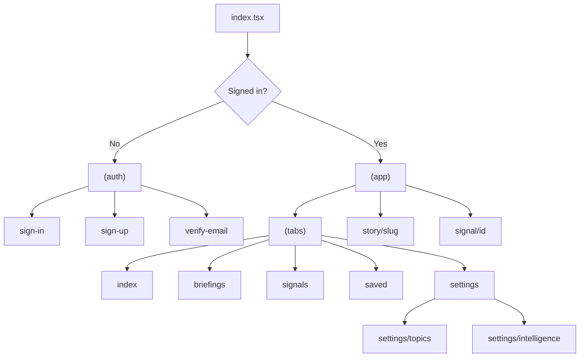
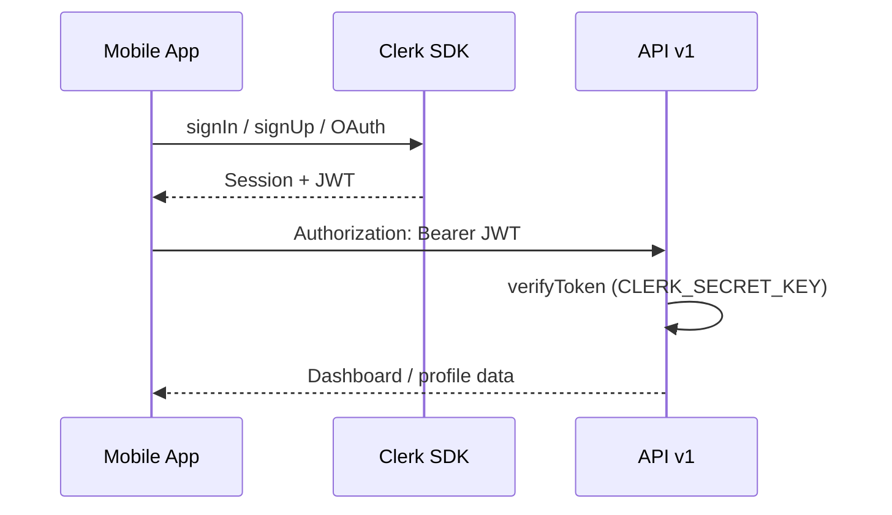
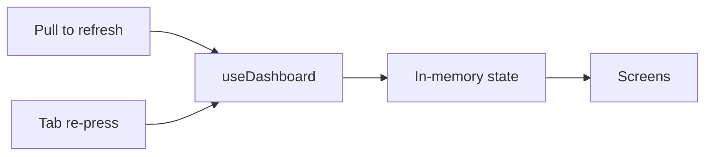
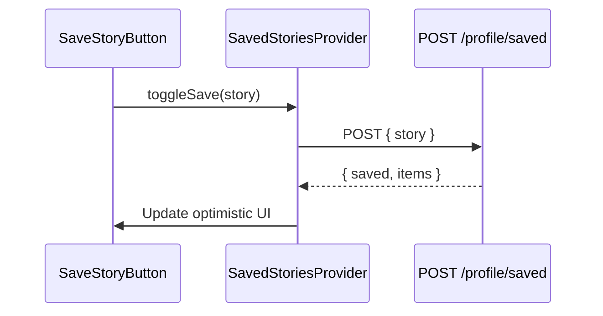

# Mobile Architecture

Expo 54 + Expo Router mobile client for Your News. Consumes API v1 on the Next.js backend with Clerk Bearer authentication.

---

## Stack

| Layer | Technology |
|-------|------------|
| Framework | Expo 54, React Native |
| Navigation | Expo Router (file-based) |
| Auth | `@clerk/clerk-expo` |
| HTTP | `fetch` via `mobile/src/api/client.ts` |
| State | React hooks + context providers |

---

## App structure

```
mobile/
├── app/                          # Expo Router routes
│   ├── _layout.tsx               # Root providers
│   ├── index.tsx                 # Auth redirect
│   ├── (auth)/                   # Sign-in, sign-up, verify
│   └── (app)/                    # Authenticated shell
│       ├── _layout.tsx
│       ├── (tabs)/               # Main tabs
│       │   ├── index.tsx         # Home / feed
│       │   ├── briefings.tsx
│       │   ├── signals.tsx
│       │   ├── saved.tsx
│       │   └── settings.tsx
│       ├── settings/
│       │   ├── topics.tsx
│       │   └── intelligence.tsx
│       ├── signal/[id].tsx
│       └── story/[slug].tsx
├── src/
│   ├── api/                      # client.ts, endpoints.ts
│   ├── hooks/                    # useDashboard, useSignals, etc.
│   ├── components/               # UI by domain
│   ├── providers/                # SavedStoriesProvider
│   ├── lib/                      # Display helpers, haptics
│   ├── theme/                    # Colors, card styles
│   └── types/                    # Shared TS types
├── app.json                      # Expo config
└── eas.json                      # EAS build profiles
```

---

## Navigation diagram



---

## Auth flow



1. **Unauthenticated** — `app/index.tsx` redirects to `(auth)/sign-in`
2. **Clerk session** — stored by Clerk SDK
3. **API calls** — `client.ts` attaches Bearer token from `getToken()`
4. **Google OAuth** — `GoogleSignInButton.tsx` + `oauth-redirect.ts`

Env: `EXPO_PUBLIC_CLERK_PUBLISHABLE_KEY`, `EXPO_PUBLIC_API_BASE_URL`.

---

## Data fetching

| Hook | Endpoint | Purpose |
|------|----------|---------|
| `useDashboard` | `GET /dashboard` | Feed + briefings + stories |
| `useSignals` | `GET /signals` | Signals tab |
| `useProfileIntelligence` | `GET /profile/intelligence` | Settings intelligence |
| `useRefreshIntelligence` | `POST /intelligence/refresh` | Manual refresh |

Endpoints defined in `src/api/endpoints.ts`. Errors surface as hook `error` state.

---

## Caching strategy

- **Dashboard** — held in hook state; refetch on pull-to-refresh and tab press (`useTabPressRefresh`, `usePullRefresh`)
- **No persistent offline DB** — in-memory only today
- **Saved stories** — `SavedStoriesProvider` syncs with server on mount and after toggle



---

## Refresh Intelligence

`IntelligenceRefreshControl` + `useRefreshIntelligence`:

1. User triggers refresh from settings or briefing screen
2. `POST /api/v1/intelligence/refresh` (may take minutes)
3. On success, dashboard hooks refetch
4. Loading state + haptic feedback (`lib/haptics.ts`)

**Note:** Long refresh requires stable network; no background task queue on mobile yet.

---

## Saved stories sync



- Initial load: `GET /profile/saved` in provider mount
- Optimistic UI with server reconciliation on error

---

## Offline behavior

| Scenario | Behavior |
|----------|----------|
| No network on launch | Shows error / empty state from last failed fetch |
| Mid-session disconnect | API errors displayed; no queue replay |
| Cached dashboard | Lost on app restart (no AsyncStorage cache) |

**Future:** Persist dashboard JSON to AsyncStorage with TTL; offline read-only mode.

---

## Story & briefing display

- **Briefings** — `BriefingView`, `BriefingSectionPager` with typography matching web
- **Story detail** — `story/[slug].tsx` uses slug param + dashboard story lookup
- **Intelligence quality** — `src/lib/story-intelligence.ts` mirrors web quality coercion
- **Dates** — `src/lib/briefing-dates.ts` for coverage vs last-updated display

---

## Theming

`src/theme/index.ts` + `cards.ts` — dark premium editorial palette aligned with web.

---

## Build & release

See [DEPLOYMENT.md](./DEPLOYMENT.md) and [APP_STORE_CHECKLIST.md](./APP_STORE_CHECKLIST.md).

```bash
cd mobile
eas build --platform ios --profile production
```

---

## Related

- [API.md](./API.md)
- [MOBILE.md](./MOBILE.md) — quick start
- [mobile/README.md](../mobile/README.md)
