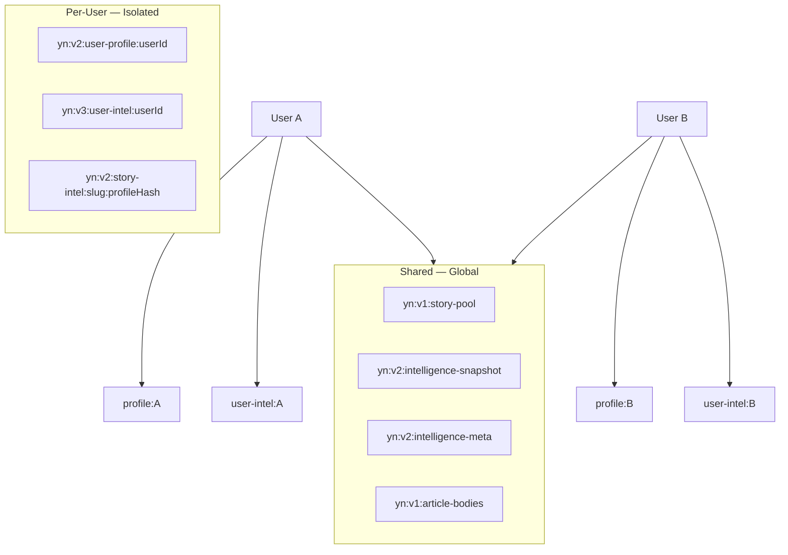
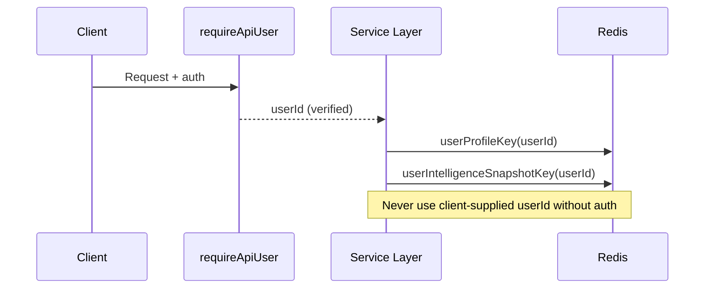
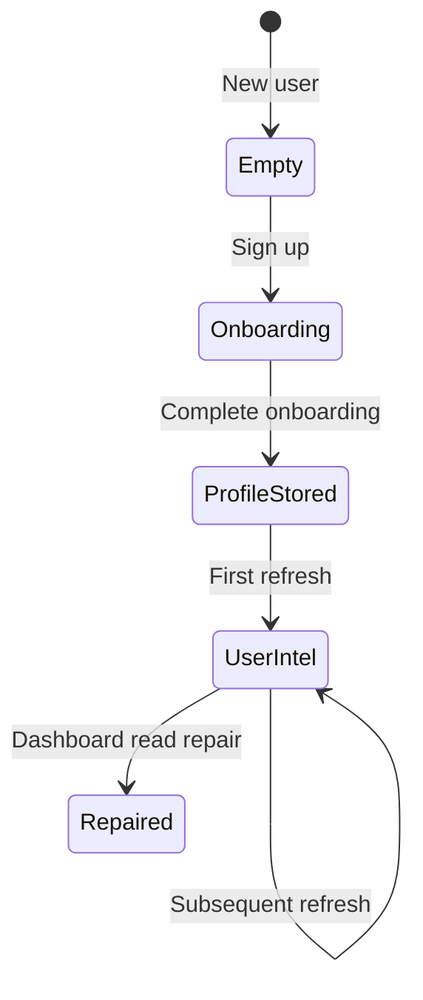

# Multi-Tenancy & User Isolation

Your News is multi-user: each authenticated Clerk user must only read and write their own preferences, saved stories, behavior, and For You intelligence. Global intelligence is shared but must never embed user-specific data.

---

## Isolation model



---

## KV key schema

Defined in `lib/persistence/keys.ts`:

| Key | Scope | Contents |
|-----|-------|----------|
| `yn:v1:story-pool` | Global | Normalized stories array |
| `yn:v1:article-bodies` | Global | Fetched article text by slug |
| `yn:v2:intelligence-snapshot` | Global | Global briefing + platform intel |
| `yn:v2:intelligence-meta` | Global | Timestamps, generation metadata |
| `yn:v2:user-profile:{userId}` | **User** | Onboarding, topics, saved, behavior |
| `yn:v3:user-intel:{userId}` | **User** | For You briefing, UIP snapshot |
| `yn:v2:story-intel:{slug}:{hash}` | **Profile-scoped** | Story intel keyed by profile hash |
| `yn:v1:weekly:{cacheKey}` | Global cache | Weekly briefing cache entries |

### User ID sanitization

```typescript
userId.replace(/[^a-zA-Z0-9_-]/g, "_").slice(0, 128)
```

Prevents key injection and unbounded key length.

---

## Component isolation matrix

| Component | Storage | Isolation mechanism |
|-----------|---------|---------------------|
| Dashboard feed | Global pool + user relevance | Ranking uses requester's profile only |
| Global briefing | Global snapshot | Same content for all users |
| For You briefing | User snapshot key | Key includes `userId` |
| UIP | User profile + user intel | Never merged across users |
| Saved stories | User profile blob | Scoped to `userId` in service layer |
| Topic preferences | User profile blob | `getTopicPreferencesForUserId(userId)` |
| Behavior tracking | User profile | Append-only per user |
| Signals list | Computed at read time | User relevance overlay; shared corpus |
| Refresh Intelligence | Writes user + global keys | `refreshPlatformIntelligence(..., { userId })` |

---

## Request path



**Rule:** `userId` always comes from Clerk session or verified JWT — never from request body.

---

## Preventing cross-user contamination

### DO

- Pass `userId` from `requireApiUser()` through all service calls
- Use `userIntelligenceSnapshotKey(userId)` for For You data
- Run `npm run verify:isolation` after persistence changes
- Use `?debugIsolation=1` on dashboard API in staging to inspect key usage

### DON'T

- Store user A's For You briefing in global snapshot keys
- Accept `userId` from client JSON body
- Share in-memory caches keyed only by profile hash without user dimension
- Log full UIP or saved stories in production logs

---

## Snapshot storage lifecycle



1. **Onboarding complete** → profile written to `yn:v2:user-profile:{userId}`
2. **Refresh** → For You briefing written to `yn:v3:user-intel:{userId}`
3. **Dashboard read** → may repair For You sections in memory (optional re-persist)

Global snapshot updates on refresh affect all users equally.

---

## Briefings isolation

| Briefing | Key | User-specific? |
|----------|-----|----------------|
| Global daily | `intelligence-snapshot` | No |
| For You daily | `user-intel:{userId}` | Yes |

For You generation reads global corpus + **only** the requesting user's UIP/topics/saved data.

---

## Signals isolation

Signals are derived from the **shared story pool**. Personalization happens at serialization time (`serializeSignalsApi`) using the authenticated user's profile — not by storing per-user signal blobs in shared keys.

---

## Refresh Intelligence isolation

`POST /intelligence/refresh`:

1. Updates **global** story pool and global briefing (shared)
2. Updates **only the requesting user's** For You snapshot and UIP

User B's refresh must not overwrite User A's `yn:v3:user-intel:` key.

---

## Verification

### Automated

```bash
npm run verify:isolation
```

Script: `scripts/verify-multi-user-isolation.ts` — simulates two users, writes distinct markers, asserts no cross-read.

### Manual QA

1. Sign in as User A — note For You section headlines
2. Sign in as User B (different browser/incognito) — headlines must differ when profiles differ
3. Save story as A — must not appear in B's saved list
4. Enable `debugIsolation=1` — confirm distinct snapshot keys

---

## Existing audit documents

- [MULTI_USER_VERIFICATION.md](./MULTI_USER_VERIFICATION.md)
- [INTELLIGENCE-ISOLATION-AUDIT.md](./INTELLIGENCE-ISOLATION-AUDIT.md)

---

## Recommendations

1. Add integration test that runs isolation script in CI (currently `continue-on-error`)
2. Namespace staging keys (`yn:staging:v3:...`) to prevent staging/prod collisions if sharing Redis
3. Audit logs for any future admin endpoints that accept arbitrary `userId`
