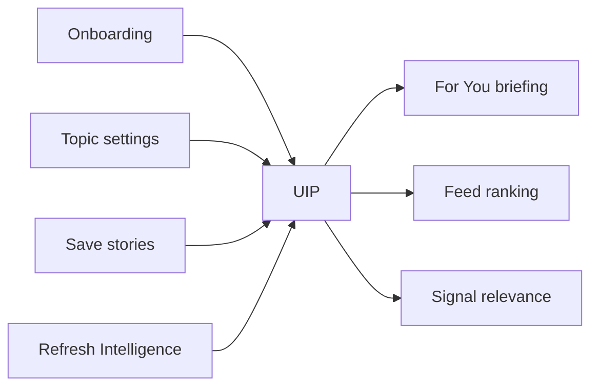

# Product Overview

## What is Your News?

Your News is a **personalized AI intelligence platform** for professionals who need curated context—not an endless scroll of headlines. It combines live news ingest, narrative clustering, and AI-generated briefings with a User Intelligence Profile (UIP) that adapts content to each reader.

---

## Who it serves

| Persona | Need |
|---------|------|
| **Executives & operators** | Daily macro + industry signal without reading 50 articles |
| **Investors & analysts** | Momentum signals and watch items across themes |
| **Knowledge workers** | Personalized "For You" intelligence aligned to role and interests |
| **Mobile-first readers** | Native iOS/Android experience synced with web account |

---

## Core workflows

### Feed (Home)

1. User opens dashboard (web or mobile home tab)
2. System loads story pool ranked by importance + personal relevance
3. Sections: lead story, relevant strip, top stories, more stories
4. Tap story → story intelligence (briefing, why it matters, watch, action)

### Briefings

1. **Global Intelligence** — daily editorial briefing across top narratives
2. **For You Intelligence** — sections tailored to UIP and topic preferences
3. User swipes sections (mobile pager) or scrolls memo layout (web)
4. **Refresh Intelligence** regenerates briefings from latest news

### Signals

1. Navigate to Signals tab
2. View narrative clusters ranked by **momentum**
3. Each signal explains why it matters to this user
4. Drill into cluster stories

### UIP (User Intelligence Profile)

Built automatically from:

- Onboarding (interests, career, preferences)
- Topic boosts and mutes (settings)
- Saved stories and engagement

Visible in settings → Intelligence. Drives For You briefing and relevance ranking.

### Saved stories

1. Save from any story card
2. Synced via API across devices
3. Saved tab shows collection; feeds back into UIP

### Personalization loop

---

## Product principles

1. **Signal over volume** — fewer, higher-quality narratives
2. **Actionable intelligence** — every section has watch + action where appropriate
3. **No article paste** — AI output must not duplicate raw news text
4. **Personal but isolated** — For You is per-user; never leak across accounts
5. **Premium editorial UX** — dark, typography-led, calm information density

---

## Platforms

| Platform | Status |
|----------|--------|
| Web (Next.js) | Production-ready core flows |
| iOS (Expo) | Feature-complete; App Store pending |
| Android (Expo) | Feature-complete; Play Store pending |

---

## Future roadmap

### Near term

- App Store / Play Store launch
- Privacy policy, terms, support site
- Push notification when briefing refreshes
- Offline dashboard cache on mobile

### Medium term

- Weekly briefing cadence in UI
- Email briefing digest
- Team / org accounts (shared global + personal layers)
- Admin analytics dashboard

### Long term

- Custom source connectors beyond NewsAPI
- User-uploaded context (PDFs, internal memos) for UIP
- Collaborative signal watchlists

---

## Related

- [ARCHITECTURE.md](./ARCHITECTURE.md)
- [INTELLIGENCE_ENGINE.md](./INTELLIGENCE_ENGINE.md)
- [APP_STORE_CHECKLIST.md](./APP_STORE_CHECKLIST.md)
